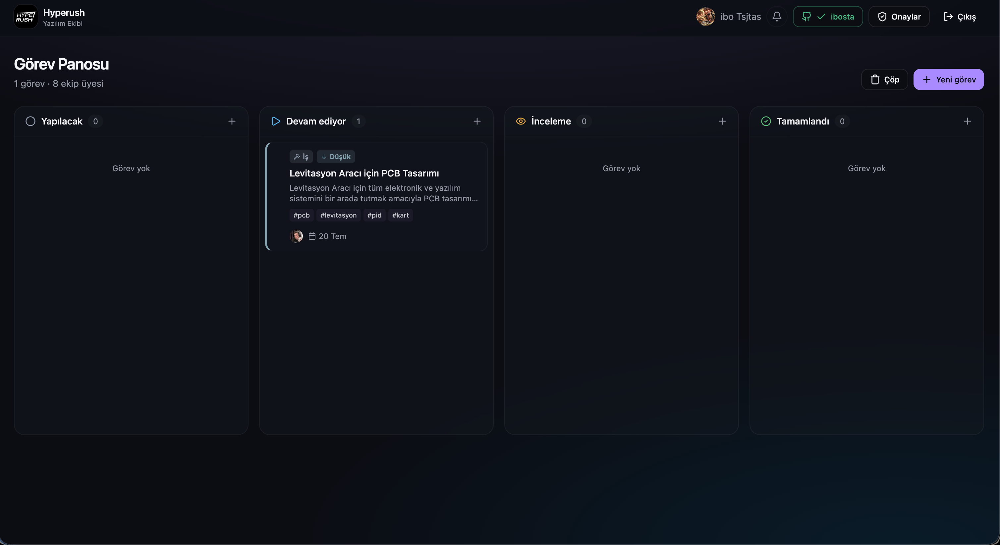
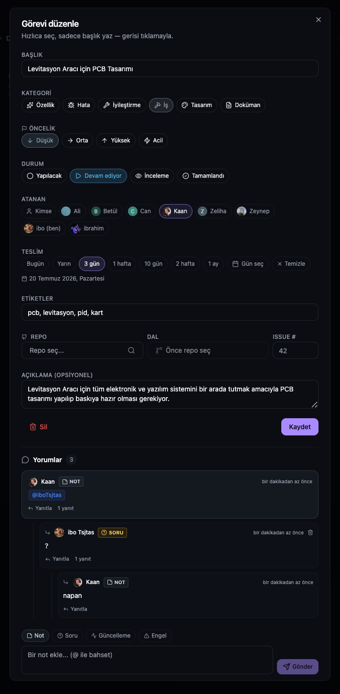

<div align="center">

# 🛡️ ClanBoard

### Real-Time Kanban Board, Project & Task Management Suite for Teams.

[](https://hyperush.itaskira.com)
[](https://github.com/ibosta)
[](https://www.docker.com)
[](https://nodejs.org)
[](https://github.com/ibosta/ClanBoard/stargazers)

<p align="center">
  ClanBoard is a self-hosted, high-performance, real-time project management application inspired by Notion, Linear, and GitHub. Designed with a gorgeous dark aesthetic, built-in system-level push notifications, structured threaded comments, and automatic Git commit integration.
</p>



</div>

---

## ⚡ Key Highlights

- **🔌 Self-Hosted Autonomy** – Zero third-party cloud database dependencies (No Supabase, Firebase, or external auth providers). Run your database and app server in a unified Docker package.
- **🔥 Burning Task Card Animation** – Visually prioritizing assignments! Tasks assigned to you display a glowing, animated ember fire border to keep you focused.
- **💬 Spaced Threading & Mentions** – Mention teammates with `@` using real-time autocompletion and Turkish character normalization. Sub-comments are styled spacing-first (no heavy borders or nested card fatigue) and collapse/expand dynamically.
- **🔔 Live System Notifications** – Instant browser toasts and native OS push alerts sliding directly onto your computer desktop, even when the tab is running in the background. Includes a ✨ Test button to check settings.
- **📧 E-posta Bildirimleri (SMTP Integration)** – Görev atanması, yorum yapılması veya duyurularda kullanıcılara sistem logosunu barındıran premium tasarımlı HTML bildirim e-postaları gönderilir. E-postalardaki butonlar/bağlantılar kullanıcıları doğrudan ilgili göreve veya yoruma yönlendirir.
- **🐙 Git Sync Engine** – Securely authenticate your GitHub account (encrypted via AES-256-GCM) to automatically match and attach commits to active board tasks every 30 seconds.
- **🛡️ First-Boot Installer Lock** – An intuitive setup wizard handles initialization and automatically locks itself down upon completion (redirecting to `/` and throwing `403` to prevent re-configuration attempts).

---

## 🏗️ Architecture & Stack

ClanBoard operates on a lightweight, modular self-contained micro-architecture.

```
┌──────────────────────────────────────────┐
│ docker compose                           │
│                                          │
│  ┌─────────────┐  ┌────────────────────┐ │
│  │ postgres:16 │◄─┤ node app :3000     │ │
│  │  pgdata vol │  │  - Express REST    │ │
│  └─────────────┘  │  - WebSocket /ws   │ │
│                   │  - Setup wizard    │ │
│                   │  - /data volume    │ │
│                   └────────────────────┘ │
│                                          │
│  ┌─────────────────────────────────────┐ │
│  │ cloudflared (Optional)              │ │
│  │  → Alanadı Tunnel Integration       │ │
│  └─────────────────────────────────────┘ │
└──────────────────────────────────────────┘
```

- **Frontend**: React 19, TanStack Router, TanStack Query, Tailwind CSS v4, shadcn/ui, `@dnd-kit`.
- **Backend**: Node.js 20, Express, `ws` (WebSockets) for Postgres `LISTEN/NOTIFY` live streaming.
- **Database**: PostgreSQL 16 (with a persistent Docker volume).

---

## 🚀 Quick Start (Docker Installation)

### 1. Clone the Codebase
```bash
git clone https://github.com/ibosta/ClanBoard.git
cd ClanBoard
```

### 2. Compile Assets
Build the optimized React client static assets:
```bash
bun install
bun run build
rm -rf deploy/frontend && cp -r dist deploy/frontend
```

### 3. Configure Local Credentials
Set your container configurations locally:
```bash
cd deploy
cp .env.example .env
# Edit .env to set a unique POSTGRES_PASSWORD
```

> 🔒 **Security Notice**: To keep your deployment private, `.env`, `deploy/.env`, `deploy/data/` (Google/GitHub keys), and `deploy/pgdata/` are pre-configured in `.gitignore` to prevent any unintended commits.

### 4. Deploy Containers
```bash
# Standard local deploy (localhost:3000)
docker compose up -d

# Deploying with an integrated Cloudflare Tunnel
docker compose --profile tunnel up -d
```

### 5. Setup Configuration Wizard
Visit `http://localhost:3000` (or your domain). The server will redirect you to the setup page to establish your:
- Google OAuth credentials
- GitHub application details (optional)
- Brand configuration

Once complete, the page is locked automatically. The **first Google account to register is instantly set as Admin**. All subsequent users require admin approval before accessing the workspace.

---

## 🧑‍💻 Local Development

Run the frontend independently (isolated Mock API):
```bash
bun install
bun run dev
# http://localhost:8080
```

Run the backend & database locally:
```bash
cd deploy
docker compose up -d db
npm install
npm run dev
# App listens on port 3000
```

---

## 🛡️ Security Details

- **Session Hardening** – Authenticated user state is signed using SHA-256 HMAC inside HttpOnly cookies.
- **Token Security** – GitHub OAuth access tokens are encrypted using **AES-256-GCM** at rest.
- **Network Isolation** – When utilizing Cloudflare Tunnel, port 3000 binds strictly to `127.0.0.1`, securing the container from raw external routing.

---

## 📸 Task & Workspace Management

Detailed task view showcasing live threaded comment feeds, tag management, status updates, and direct GitHub commit attachments:



---

## 📄 License & Maintainer

Crafted by **[ibosta](https://github.com/ibosta)**. Internal team task suite.  
For support or inquiries, reach out to: **info@podhyperush.com**
